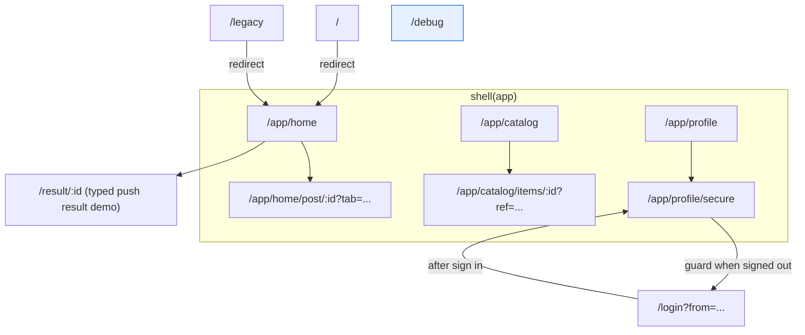
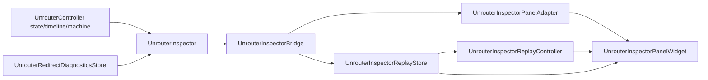

# unrouter_example

Runnable reference app for the redesigned `unrouter` API.

## Run

```bash
flutter pub get
flutter run -d chrome
```

## Route map

- `/app/home`: home branch (typed push result demo + machine envelope demo)
- `/app/home/post/:id?tab=...`: typed path/query parsing + transition override
- `/app/catalog`: catalog branch
- `/app/catalog/items/:id?ref=...`: `routeWithLoader` async loader demo
- `/app/profile`: profile branch
- `/app/profile/secure`: guard-protected route (redirects to `/login` when signed out)
- `/legacy`: route-level redirect to `/app/home`
- `/debug`: debug center (inspector/bridge/panel/replay entry)

## Route graph



## Core capabilities covered

- Typed routes via `RouteData` + `route<T>()`
- Shell/branch stacks via `shell()` + `branch()`
- `context.unrouter` navigation: `go`, `push`, `replace`, `back`, `pop`
- Typed push result delivery (`push<T>()` and `pop(result)`)
- Guard/redirect behavior with real sign-in flow
- Async loader with cancellation-safe pattern (`context.signal.throwIfCancelled()`)
- Machine action envelope demo (`dispatchActionEnvelope`)

## Debug entry

Open `/debug` (or click the bug icon in app bar).  
The page wires:

- `UnrouterInspectorWidget`
- `UnrouterInspectorBridge`
- `UnrouterInspectorPanelAdapter`
- `UnrouterInspectorPanelWidget`
- `UnrouterInspectorReplayStore` + `UnrouterInspectorReplayController`

It provides manual emission, replay export/import, baseline diff, replay
compatibility validation, and replay play/pause controls.

## Debug data flow


